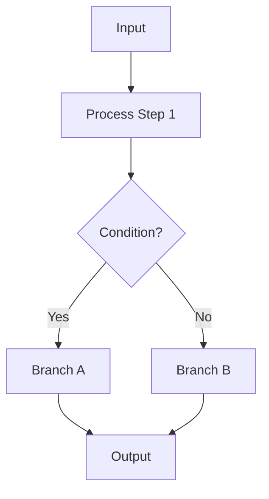
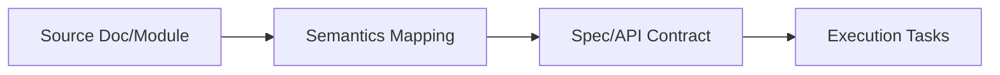
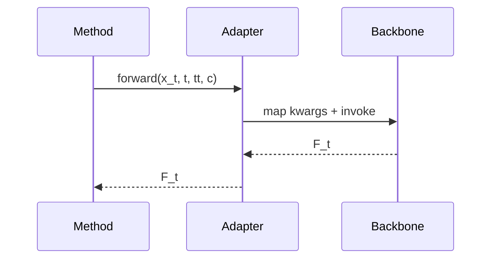
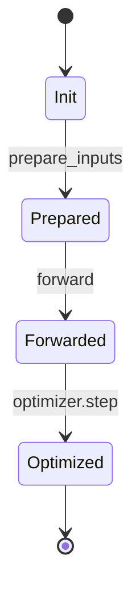
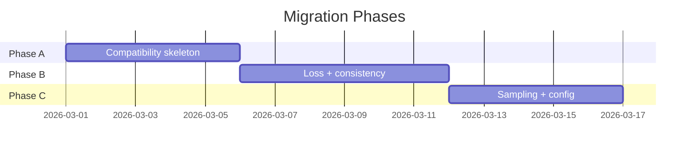

# Mermaid Patterns for Markdown

Use these patterns as starting points and adapt labels to the current document domain.

## 1. Workflow Flowchart

Use for migration flows, training loops, decision gates, and execution playbooks.

## 2. Dependency Flow (Left to Right)

Use for "document relationship", "module handoff", and "pipeline ownership" sections.

## 3. Sequence Interaction

Use when call order matters more than static dependencies.

## 4. State Transition

Use when document semantics are stateful and transitions must be explicit.

## 5. Phase Timeline (Gantt)

Use only when the document already owns concrete date windows.

## Placement Guidance

- Insert diagram under the nearest heading that describes the same logic.
- Avoid a standalone diagram at file end without local explanation.
- For long documents, prefer multiple small diagrams over one dense graph.
